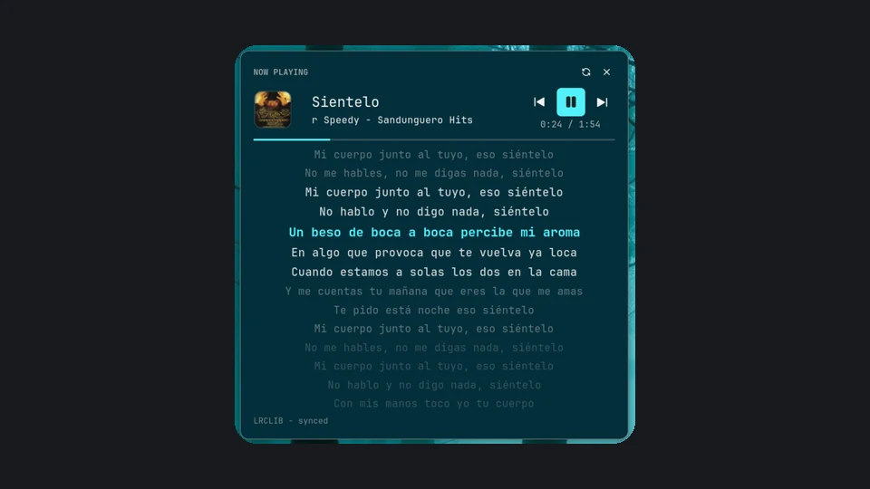

<p align="center">
  
</p>

<h1 align="center">Media Lyrics</h1>

<p align="center">
  <b>Karaoke-style synced lyrics panel for the Noctalia desktop shell.</b><br>
  Pure Luau · zero external dependencies · any MPRIS player
</p>

<p align="center">
  <a href="https://github.com/TraNZeM/media-lyrics/releases"></a>
  <a href="LICENSE"></a>
  <a href="https://github.com/TraNZeM/media-lyrics/blob/main/media-lyrics/README.md"></a>
  <a href="https://img.shields.io/badge/language-Luau-2C2D72"></a>
  <a href="https://img.shields.io/badge/source-LRCLIB-22c55e"></a>
</p>

A full-featured media player panel with **time-synced lyrics**: karaoke-style
lyric carousel (14 visible lines), album cover, transport controls, and a
progress bar — all in one floating panel. **No playerctl, no python daemons,
no GTK overlays** — it reads MPRIS directly via Noctalia's D-Bus aggregator
and fetches lyrics from LRCLIB in pure Luau.

## Screenshots

| Light theme | Dark theme |
| --- | --- |
|  |  |

| Settings |
| --- |
|  |

## Features

- 🎤 **Karaoke carousel** — 14 visible lyric lines, active line highlighted,
  neighbours fade by distance; whole verses stay in view
- 🏃 **Marquee titles** — long track/artist names hold for 2 s, then scroll
  instead of wrapping or clipping
- 🎚️ **Transport controls + progress** — prev / play-pause / next, shuffle &
  repeat state, interpolated progress bar
- 📦 **Zero dependencies** — pure Luau, works with any MPRIS player
- 💾 **Offline-friendly** — LRCLIB cache + local `.lrc` files with priority
- 🌐 **Bilingual** — en/ru UI, timing offset & cache settings

## Why Media Lyrics?

Compared with typical lyric plugins for desktop shells, this one is built
around a deliberately different set of trade-offs:

- **Zero external dependencies.** Most lyric plugins require a stack of
  third-party tools — `playerctl`, a Python interpreter, pip packages, GTK
  overlay libraries — each of which must be installed, kept in sync, and
  maintained across upgrades. Media Lyrics is pure Luau: enable the plugin
  and it works.
- **No background daemons.** Other plugins expect you to manually install and
  start a separate process (often a systemd user unit) that watches your
  player and feeds lyrics to the shell. Here the MPRIS polling, lyric
  fetching, parsing and caching all live inside the plugin's own service —
  nothing extra to run, stop, or restart.
- **No per-player setup.** No API tokens to generate, no "connectivity" to
  switch on inside a specific player app, no config files to hand-edit. Any
  MPRIS-capable player (Spotify, MPD, Cider, VLC, web players…) is picked up
  automatically.
- **A real panel, not a bar snippet.** Many lyric plugins squeeze the current
  line into a 1–3 line bar widget or a tiny card. This is a 520×520 floating
  panel with 14 visible lines — you read the whole verse, not a glimpse.
- **Player controls included.** Playback buttons, shuffle/repeat state and a
  progress bar are part of the panel; display-only widgets leave you reaching
  for the player app.
- **Overflow handled properly.** Long titles marquee-scroll, embedded newlines
  in metadata are sanitized, glyph overlap is prevented — text is never
  clipped or garbled.
- **Offline-friendly.** Fetched lyrics are cached on disk and local `.lrc`
  files take priority, so the panel keeps working without network access.

## Install

```sh
noctalia msg plugins enable tranzem/media-lyrics
noctalia msg panel-toggle tranzem/media-lyrics:panel
```

## Documentation

- [Plugin README](media-lyrics/README.md) — usage, settings, IPC, features
- [Roadmap & knowledge base](docs/ROADMAP.md) — To Do and research notes
- [Changelog](media-lyrics/CHANGELOG.md)
- [Contributing](CONTRIBUTING.md)

## License

[MIT](LICENSE)
